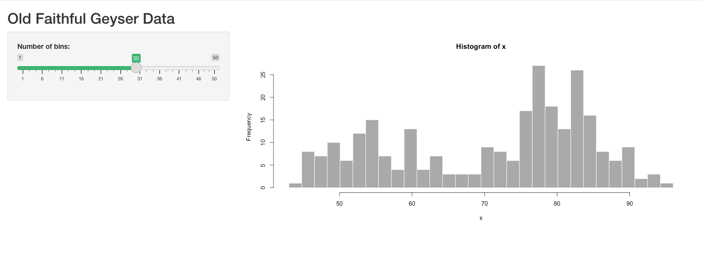
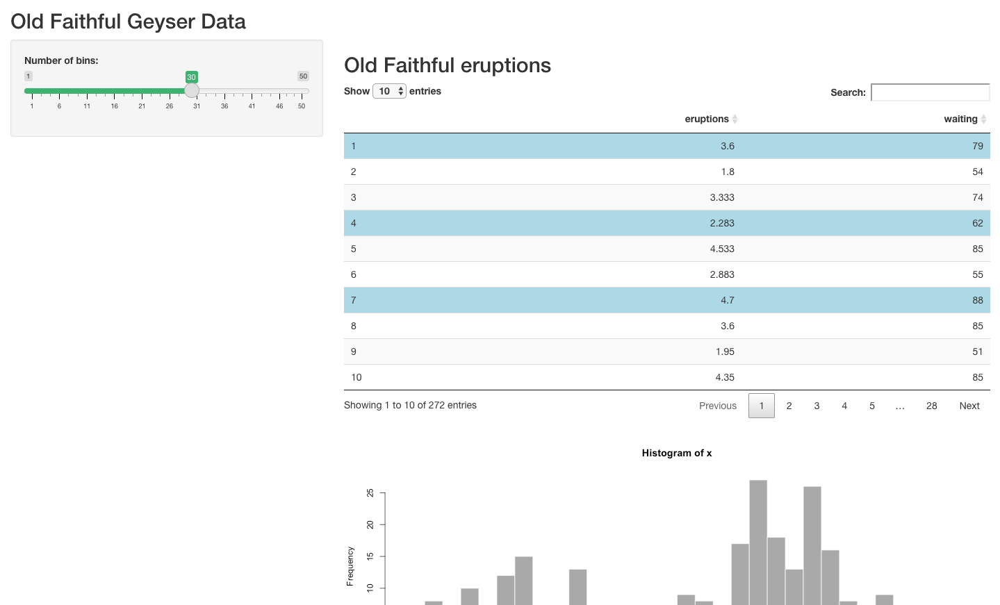
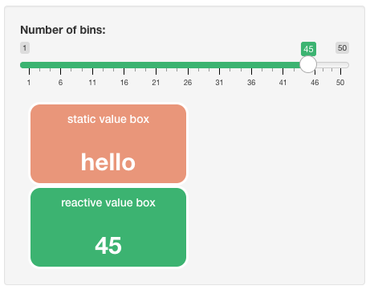
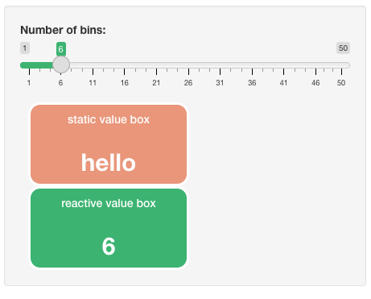

<!-- README.md is generated from README.Rmd. Please edit that file -->

```{r, include = FALSE}
knitr::opts_chunk$set(
  collapse = TRUE,
  comment = "#>",
  fig.path = "man/figures/README-",
  out.width = "100%"
)
```
<h1> RshinyHelpers </h1>

<!---[](https://lifecycle.r-lib.org/articles/stages.html#experimental)
[](https://github.com/ramnathv/test9/actions)
-->

</img>

A small package of utility functions for various applications including 

- Time Series 
- RShiny
- Regex
- Common patterns in handling unordered relations in Data Frames
- Data quality checking and QA

The package, despite covering multiple operations and bases is named 'RShinyHelpers', mostly because it started out as a Shiny package, but also in recognition that most projects aspire to a functioning Shiny app at their end.  Shiny is an accessible and highly effective tool to communicate, and these functions support the end product.

## Intro 👣
The package is a combination of utility functions for data tidying and data manipulation that don't fit into any tidy workflow.  For beginners do please see the tidyverse packages dplyr and tidyr for data manipulation and reformatting.

A first hack at compiling useful functionality that I could not see elsewhere in the open source community.  **I do not advise using in a production environment.**  ALL feedback welcome.

## Usage

### Install the development version from [GitHub](https://github.com/) 👉

``` r
# install.packages("devtools")
devtools::install_github("aarong1/RshinyHelpers")
```

```{r setup, include=FALSE}

devtools::load_all()
#library(RShinyHelpers)

```

## Load

```{r load }
# load the package into the namespace
library(RShinyHelpers)
```

## Examples

See some of the features displayed in a visually striking shiny application.  Run by loading the package and running `demoApp()`

## Shiny

### SliderInput 
We can change individual slider colours in bootstrap


This function applies to the _individual_ slider components. We apply by referencing the index of the bootstrap slider in the order in which they appear in the ui.  See the docs for more on this

### DT
We can change the default row **selection colour** on DataTables from the DT package.



and we have really nice styled and formatted **value boxes**.  Surprising hard to come by given the maturity of shiny as a dashboarding tool.


Making the boxes' values **reactive is easy!** As is formatting the **colour** to suit your dashboard's aesthetics




## Text tidying 

`rmPWCap(c('He1l0 ! W0rId'),rm_all_white_space = F)`
`#> "HE1L0 W0RID"`

`rmPWCap(c('He1l0 ! W0rId'),rm_all_white_space = T)`
`#> "HE1L0W0RID" `


## Error finding

`chk_nas()`

simply wraps 

`which(is.na(data.frame))`

where as `chk_dups()`

simply wraps which entries in a dataframe is duplicated

`which(duplicated(data.frame))`
