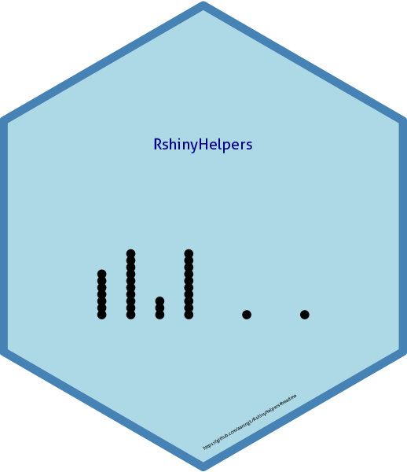
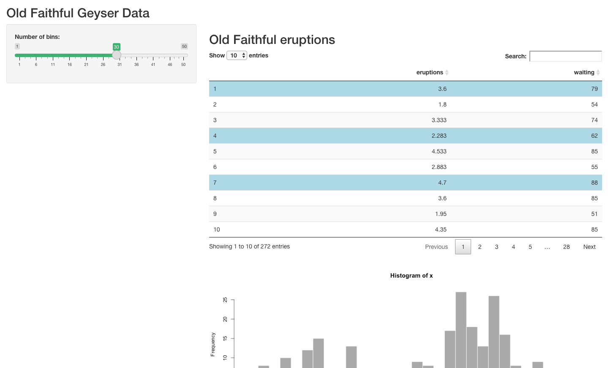

# RshinyHelpers 😙  

 
 
A small package of utiility functions

## Intro 👣
The package is a combination of utility functions for data tidying and data manipulation. That doesn't fit into any really tidy workflow.  For beginners do please see the tdiyverse packages dplyr and tidyr for data mamipulation and reformatting.

This is my first hack at creating an R package and I don't anticipate maintaining or commiting to CRAN. **Nor do I advise using in production for these reasons**  I welcome all feedback!

## Usage

### Install 👉

`R install_github('aarong1/RshinyHelpers')`

for the latest version
### Load in Global Namespace

`R library(Rpack)`

# Shiny

We can change individual slider colours in bootstrap

This applies to the individual slider components. We appy by referenceing the index
of the bootstrap slider in the order in which they appear in the ui.  See the cods for more on this

We can change the default row selection colour on DataTables from the DT package.

and have really nice styled and formatted value boxes

Making them reactive is easy! As is formatting the colour to suit your dashboard's aesthetics

# Text tidying 

` rmPWCap(c('He1l0 ! W0rId'),rm_all_white_space = F)`
> [1] "HE1L0 W0RID"

` rmPWCap(c('He1l0 ! W0rId'),rm_all_white_space = T)`
> [1] "HE1L0W0RID" 

# Error finding

`chk_nas()
`
simply wraps which(is.na(data.frame))

`chk_dups()`

simply wraps which entries in a dataframe is duplicated `which(duplicated(data.frame))`
