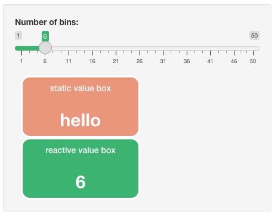

<!-- README.md is generated from README.Rmd. Please edit that file -->
<h1>
RshinyHelpers
</h1>
<!---[](https://lifecycle.r-lib.org/articles/stages.html#experimental)
[](https://github.com/ramnathv/test9/actions)

</img>
-->

A small package of utility functions for various applications

## Intro 👣

The package is a combination of utility functions for data tidying and
data manipulation that don’t fit into any tidy workflow. For beginners
do please see the tidyverse packages dplyr and tidyr for data
manipulation and reformatting.

This is my first hack at creating an R package and I don’t anticipate
maintaining or committing to CRAN. **Nor do I advise using in production
for these reasons.** I welcome all feedback!

## Usage

### Install the development version from [GitHub](https://github.com/) 👉

``` r
# install.packages("devtools")
devtools::install_github("aarong1/RshinyHelpers")
```

## Example

``` r
library(Rpack)
## basic example code
```

# Shiny

### We can change individual slider colours in bootstrap


### This applies to the individual slider components. We appy by referenceing the index of the bootstrap slider in the order in which they appear in the ui. See the docs for more on this

### We can change the default row selection colour on DataTables from the DT package.


### and have really nice styled and formatted value boxes


### Making them reactive is easy! As is formatting the colour to suit your dashboard’s aesthetics

 

# Text tidying

`rmPWCap(c('He1l0 ! W0rId'),rm_all_white_space = F)`

> \[1\] “HE1L0 W0RID”

`rmPWCap(c('He1l0 ! W0rId'),rm_all_white_space = T)`

> \[1\] “HE1L0W0RID”

## Error finding

`chk_nas()`

### simply wraps

`which(is.na(data.frame))`

#### where as

`chk_dups()`

### simply wraps which entries in a dataframe is duplicated

`which(duplicated(data.frame))`
